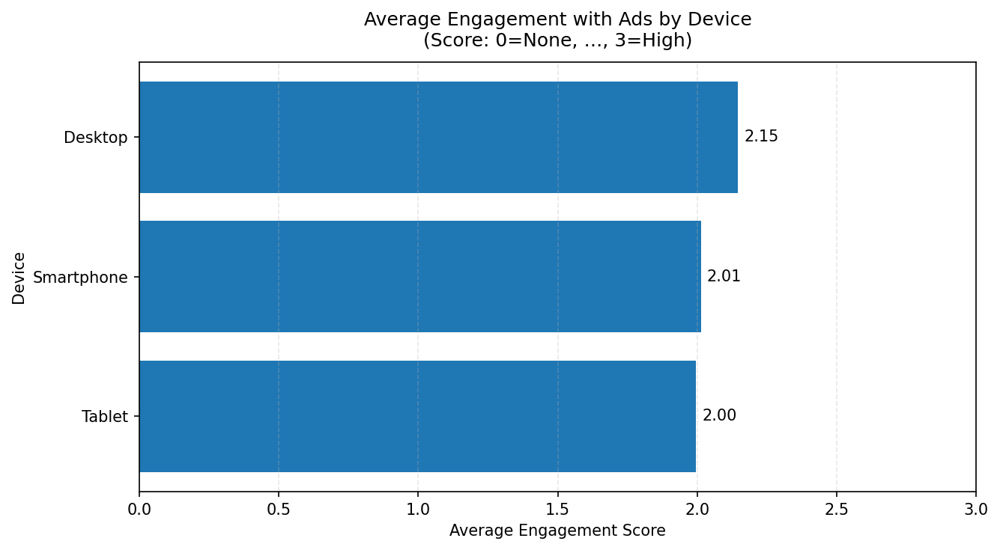

# Consumer Behavior HW 2  

[](https://github.com/TeaTafaj/Consumer-Behavior-HW-2/actions/workflows/ci.yml)  

This project explores **consumer behavior** using Python (Pandas, Matplotlib, scikit-learn). The analysis investigates the relationship between **device type** and **ad engagement**, includes data cleaning, filtering, grouping, visualization, and a first machine learning experiment.  
Dataset: Ecommerce Consumer Behavior Data from Kaggle, https://www.kaggle.com/datasets/salahuddinahmedshuvo/ecommerce-consumer-behavior-analysis-data

---

## 📂 Repository Structure  

├── Consumer_Behavior.py # main analysis script
├── Ecommerce_Consumer_Behavior_Analysis_Data.csv # dataset
├── requirements.txt # dependencies
├── Makefile # automation commands
├── test_consumer_behavior.py # simple pytest tests
├── .github/workflows/ci.yml # GitHub Actions CI workflow
└── README.md # this file


---

## 🎯 Hypothesis  

Shoppers using Smartphone devices have higher engagement with ads than shoppers using desktop.   

---

## 🔎 Steps Performed  

### 1. Data Import & Inspection  
- Loaded CSV using Pandas  
- Explored dataset with `.head()`, `.info()`, `.describe()`  
- Checked for missing values and unique categories  

### 2. Data Cleaning  
- Dropped rows with missing `Engagement_with_Ads` values  
- Standardized text values ('None', `Low`, `Medium`, `High`)  
- Converted engagement to numeric scores ('None'=0,`Low=1, Medium=2, High=3`)  

### 3. Filtering  
- Extracted subsets of data (e.g., only smartphone users)  

### 4. Grouping  
- Grouped by `Device_Used_for_Shopping`  
- Computed **average engagement score per device**  

### 5. Visualization  
- Bar chart comparing engagement score by device  
- Output file: **`ads_by_device.png`**  

### 6. Machine Learning Experiment  
- Logistic Regression: predict whether a user’s ad engagement is **High (yes/no)** from device type  
- Accuracy: ~**64%**  
- Coefficients indicated desktop users were slightly more likely to have high engagement  

---

## 📊 Findings  

- **Result:** contrary to the initial hypothesis, **desktop users** had the highest average engagement (≈2.15), compared to smartphones (≈2.01) and tablets (≈2.00).  
- **Interpretation:** this dataset suggests that desktop shoppers may engage more with ads than mobile users — possibly due to a more focused browsing context.  

  

---

## ⚙️ Usage  

### Prerequisites  
- Python 3.11+  
- Install dependencies:  
```bash
pip install -r requirements.txt

Run the analysis
python Consumer_Behavior.py
make install   # install dependencies
make lint      # run flake8 checks
make test      # run pytest tests
make run       # run the analysis
make clean     # clean up cache and generated files

#✅ Tests

-pytest provides simple tests, e.g.:

-Ensure dataset loads correctly

-Confirm cleaning step adds the expected Engagement_with_Ads_Score column

Run: pytest -q

## 🐳 Docker

### Setup
- **Prereqs**: Install Docker (Docker Desktop on Windows/macOS) and make sure the engine is running.
- Build the image (from the repo root):
```bash
docker build -t consumer-behavior .
```

### Use
**Run the analysis (default command in the image):**
```bash
docker run --rm consumer-behavior
```

**Run with live code edits (mount your working directory)**
- macOS/Linux:
```bash
docker run --rm -it -v "$(pwd)":/app -w /app consumer-behavior python Consumer_Behavior.py
```
- Windows PowerShell:
```powershell
docker run --rm -it -v ${PWD}:/app -w /app consumer-behavior python Consumer_Behavior.py
```

**Run tests (pytest)**
```bash
docker run --rm -it -v "$(pwd)":/app -w /app consumer-behavior pytest -q
```

**Run Makefile targets inside the container**
(Requires the provided Dockerfile—which includes `make`—to be built as above.)
- macOS/Linux:
```bash
docker run --rm -it -v "$(pwd)":/app -w /app consumer-behavior make test     # runs pytest
docker run --rm -it -v "$(pwd)":/app -w /app consumer-behavior make run      # runs analysis
docker run --rm -it -v "$(pwd)":/app -w /app consumer-behavior make lint     # runs flake8 (if defined)
```
- Windows PowerShell:
```powershell
docker run --rm -it -v ${PWD}:/app -w /app consumer-behavior make test
docker run --rm -it -v ${PWD}:/app -w /app consumer-behavior make run
docker run --rm -it -v ${PWD}:/app -w /app consumer-behavior make lint
```

**Notes**
- The container uses a headless Matplotlib backend, so plots save to files (e.g., `ads_by_device.png`) without a display.

